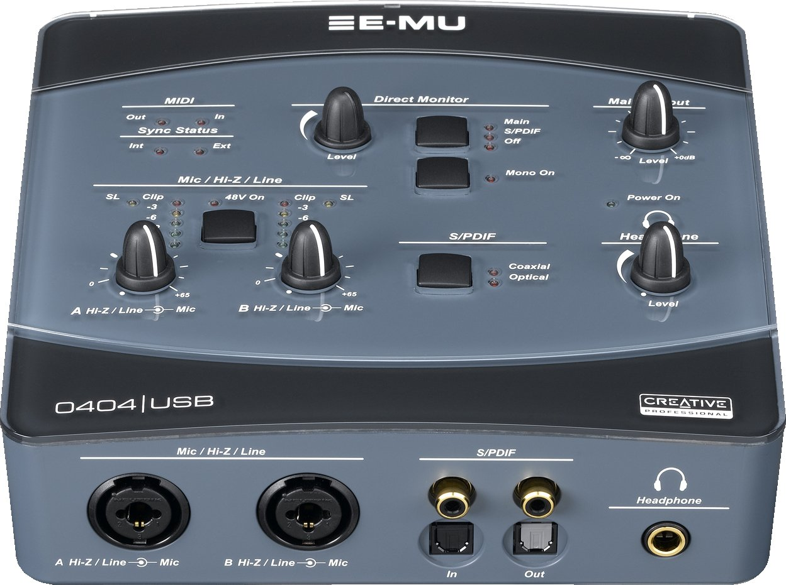

EMU-USB driver
=============

OSX driver for Creative Labs EMU USB

The current version compiles with Xcode 5.1.1.
Original comes from source forge revision 7. http://sourceforge.net/projects/zaudiodrivermac/
But it did not compile on OSX 10.9 Mavericks. So I dumped part of the code, cleaned up, documented, 
refactored and wrote new code to get it working.

The present version is in a pretty bad shape. I did a major effort to refactor the input side of the code,
it's on the way but not yet polished. The rest of the code is still in original state.
The first priority here was to get the audio input working properly, without the clicking issues of the official driver when used in OSX10.6 and higher. The playback at this points works ok but there are still a few small issues.

* This version works on Mavericks but not on Yosemite (see issue #18).
* All sample rates are supported both for record and playback: 44.1, 48, 88.2, 96, 176.4 and 192 kHz
* I can only test on EMU0404 USB as I have no other EMU devices. 
* Midi is currently not supported (#23).

Please notify me how my driver works on other EMU USB devices.


Installation
========
1. Turn off the EMU device
2. Download (click on "Download ZIP") and unzip the driver
3. Run the kextInstall script 
4. enter your admin password at the prompt

or

1. manually copy EMUUSBAudio.kext into  /System/Library/Extensions/ 
2. reboot

If you like you can also copy the control panel into your applications directory.

Ext not loading
======
The driver is not signed and OSX may refuse to load.
To allow loading, open a console and give the following command

```
sudo nvram boot-args="kext-dev-mode=1"
```

and reboot the machine. 


Usage
======

1. Install the driver as above
2. Use the EMU control panel to select the sample rate you want
3. Select the EMU input in your favourite tool (e.g., Audacity)
4. Make your recording

Uninstall
=======
Download and install the original EMU driver provided by E-MU (http://support.creative.com/Products/ProductDetails.aspx?catID=237&catName=USB+Audio%2fMIDI+Interfaces&subCatID=611&subCatName=USB+Audio%2fMIDI+Interfaces&prodID=15185&prodName=0404+USB+2.0&bTopTwenty=1&VARSET=prodfaq:PRODFAQ_15185,VARSET=CategoryID:237)

OR

1. rename EMUUSBAudio original.kext to EMUUSBAudio.kext
2. Turn off your EMU device
3. run the kextInstall script


Building from source code
===================

1. Open the project in Xcode (double click src/EMUUSBAudio.xcodeproj)
2. Select Product/Build menu item
3. Select View/Navigators/Project Navigator menu item
4. right click on the  EMUUSBAudio.kext and click "Show in finder"
5. Copy the kext into the directory where the kextInstall script is

After that the kExtInstall script is ready for use (see Installation)


Technical Specifications
========================


General
------

 * Sample Rates: 44.1, 48, 88.2, 96, 176.4, 192kHz from internal crystal (no sample rate conversion)
  * Bit Depth: 24-bit I/O, 32-bit processing
 * USB 2.0 Hi-Speed
  * Full 24-bit resolution at all sample rates
  * 4in/4 out channels from 44.1-96kHz
  * 2 in/2 out channels from 176.4-192kHz
 * Zero-latency direct hardware monitoring (disabled at 176.4-192kHz)
 * Apple CoreAudio (currently no CoreMIDI support).
  * AC3 and DTS Passthru supported (not tested if this works)
 * Anti-Pop speaker protection minimizes noise during power on/off
 * Ultra-low jitter clock subsystem: < 500ps RMS in PLL mode (48kHz, Coaxial S/PDIF Sync)
   
Combo Microphone Preamplifier/Hi-Z/Line Inputs (2)
------

 * Type: E-MU XTC™ combo mic preamplifier and Hi-Z/line input w/ Soft Limiter
 * A/D converter: AK5385A
 * Gain Range: +60dB
 * Frequency Response (min gain, 20Hz-20kHz): +0.0/-0.16dB
 * Stereo Crosstalk (1kHz min gain, -1dBFS): < -110dB
 * Hi-Z Line Input:

  * Input Impedance: 1M&Omega;
  * Max Level: +12dBV (14.2dBu)
  * Dynamic Range (A-weighted, 1kHz, min gain): 113dB
  * Signal-to-Noise Ratio (A-weighted, min gain): 113dB
  * THD+N (1kHz at -1dBFS, min gain): -101dB (.0009%)
 * Microphone Preamplifier:

  * Input Impedance: 1.5k&Omega;
  * Max Level: +6dBV (+8.2dBu)
  * EIN (20Hz-20kHz, 150&Omega;, unweighted): -127dBu
  * Signal-to-Noise Ratio (A-weighted, min gain): 112.5dB
  * THD+N (1kHz at -1dBFS, min gain): -101dB (.0009%)
  * Phantom Power: 48V
  * Soft Limiter: 5dB max compression (software selectable)
  
Analog Line Outputs (2)
------

 * Type: balanced, AC-coupled, 2-pole low-pass differential filter
 * D/A converter: AK4396
 * Level (auto detect):

  * Professional: +12dBV max (balanced)
  * Consumer: +6dBV max (unbalanced)
 * Frequency Response (20Hz - 20kHz): 0.06/-.035dB
 * Dynamic Range (1kHz, A-weighted): 117dB
 * Signal-to-Noise Ratio (A-weighted): 117dB
 * THD+N (1kHz at -1dBFS): -100dB (.001%)
 * Stereo Crosstalk (1kHz at -1dBFS): < -114.5dB
 * Balanced/Unbalanced Output Impedance: 560&Omega;
 
Headphone Amplifier
------

 * Type: Class-A power amplifier
 * D/A converter: AK4396 (shared with Line Out)
 * Gain Range: 60dB
 * Maximum Output Power: 20mW
 * Output Impedance: 22&Omega;
 * Frequency Response (20Hz-20kHz): +0.06/-0.035dB
 * Dynamic Range (A-weighted): 114dB
 * Signal-to-Noise Ratio (A-weighted): 114dB
 * THD+N (1kHz, max gain): 600&Omega; load: -95.5dB (.0018%)
 * Stereo Crosstalk (1kHz at -1dBFS, 600&Omega; load): < -85dB
 
Digital I/O
------

 * S/PDIF*:
  * 2 in/2 out coaxial (transformer coupled)
  * 2 in/2 out optical
  * AES/EBU or S/PDIF format (software selectable)
 * MIDI (not tested if this works)
  * 1 in, 1 out
  
Synchronization
------

 * Internal crystal sync at 44.1, 48, 88.2, 96, 176.4, 192kHz
 * External sample rate sync via
  * Optical S/PDIF (44.1 - 96kHz)
  * Coaxial S/PDIF (44.1 - 96kHz)
  
System Requirements
------

 * Apple Macintosh 
 * Apple Macintosh OS X Mavericks (10.9) 64 bits
 * 1 available (Hi-speed) USB 2.0 port
 